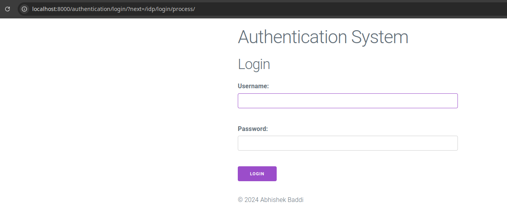

# About

A django IdP implementation using djangosaml2idp and Keycloak.

## Project setup

### Create a virtual environment and install the requirements.

```bash
python -m venv .venv
source .venv/bin/activate
pip install -r requirements.txt
```

### Do the migrations

```bash
python manage.py migrate
```

### Create a superuser to access the admin page

```bash
python manage.py createsuperuser --username aby
python manage.py runserver
```

### Generate your openssl certificates

```bash
openssl req -nodes -new -x509 -newkey rsa:2048 -days 3650 -keyout private.key -out public.cert
```

### Navigate to the metadata endpoint

Django's Metadata endpoint: http://localhost:8000/idp/metadata/

Verify that the metadata endpoint is accessible and contains the following information:

```xml
<ns0:EntityDescriptor xmlns:ns0="urn:oasis:names:tc:SAML:2.0:metadata" xmlns:ns1="urn:oasis:names:tc:SAML:metadata:algsupport" xmlns:ns2="http://www.w3.org/2000/09/xmldsig#" entityID="http://localhost:8000/idp/metadata/" validUntil="2034-09-22T08:04:38Z"><ns0:Extensions><ns1:DigestMethod Algorithm="http://www.w3.org/2001/04/xmldsig-more#md5"/><ns1:DigestMethod Algorithm="http://www.w3.org/2001/04/xmlenc#ripemd160"/><ns1:DigestMethod Algorithm="http://www.w3.org/2000/09/xmldsig#sha1"/><ns1:DigestMethod Algorithm="http://www.w3.org/2001/04/xmldsig-more#sha224"/><ns1:DigestMethod Algorithm="http://www.w3.org/2001/04/xmlenc#sha256"/><ns1:DigestMethod Algorithm="http://www.w3.org/2001/04/xmldsig-more#sha384"/><ns1:DigestMethod Algorithm="http://www.w3.org/2001/04/xmlenc#sha512"/><ns1:SigningMethod Algorithm="http://www.w3.org/2000/09/xmldsig#dsa-sha1"/><ns1:SigningMethod Algorithm="http://www.w3.org/2009/xmldsig11#dsa-sha256"/><ns1:SigningMethod Algorithm="http://www.w3.org/2001/04/xmldsig-more#ecdsa-sha1"/><ns1:SigningMethod Algorithm="http://www.w3.org/2001/04/xmldsig-more#ecdsa-sha224"/><ns1:SigningMethod Algorithm="http://www.w3.org/2001/04/xmldsig-more#ecdsa-sha256"/><ns1:SigningMethod Algorithm="http://www.w3.org/2001/04/xmldsig-more#ecdsa-sha384"/><ns1:SigningMethod Algorithm="http://www.w3.org/2001/04/xmldsig-more#ecdsa-sha512"/><ns1:SigningMethod Algorithm="http://www.w3.org/2001/04/xmldsig-more#rsa-md5"/><ns1:SigningMethod Algorithm="http://www.w3.org/2001/04/xmldsig-more#rsa-ripemd160"/><ns1:SigningMethod Algorithm="http://www.w3.org/2000/09/xmldsig#rsa-sha1"/><ns1:SigningMethod Algorithm="http://www.w3.org/2001/04/xmldsig-more#rsa-sha224"/><ns1:SigningMethod Algorithm="http://www.w3.org/2001/04/xmldsig-more#rsa-sha256"/><ns1:SigningMethod Algorithm="http://www.w3.org/2001/04/xmldsig-more#rsa-sha384"/><ns1:SigningMethod Algorithm="http://www.w3.org/2001/04/xmldsig-more#rsa-sha512"/></ns0:Extensions><ns0:IDPSSODescriptor protocolSupportEnumeration="urn:oasis:names:tc:SAML:2.0:protocol" WantAuthnRequestsSigned="true"><ns0:KeyDescriptor use="signing"><ns2:KeyInfo><ns2:X509Data><ns2:X509Certificate>MIIDkzCCAnugAwIBAgIUWtHgtQtduarslIIAs3GqP1FLQpQwDQYJKoZIhvcNAQELBQAwWTELMAkGA1UEBhMCSU4xEzARBgNVBAgMClNvbWUtU3RhdGUxITAfBgNVBAoMGEludGVybmV0IFdpZGdpdHMgUHR5IEx0ZDESMBAGA1UEAwwJYWJoaXNoZWtiMB4XDTI0MDkyNDA3NDAxMVoXDTM0MDkyMjA3NDAxMVowWTELMAkGA1UEBhMCSU4xEzARBgNVBAgMClNvbWUtU3RhdGUxITAfBgNVBAoMGEludGVybmV0IFdpZGdpdHMgUHR5IEx0ZDESMBAGA1UEAwwJYWJoaXNoZWtiMIIBIjANBgkqhkiG9w0BAQEFAAOCAQ8AMIIBCgKCAQEAwL1RjmcdFKfoCGjId372L3VOcbi0HcwcC1q5C+++6b1BgSXpoXV88CO46qY84HS9GkuInSDnYzJ3Oq39NJN9gKlvn84Zz5j+knX60LbvPHx50sHzNn+3qphAvxZ/TlHEfeuWeYfDj6wxzho+LXOo0WTEI/PjMKQ+qmHx3bdoa8wU6vmbF0P9hAx/KdecjFFRV4J5djQyJozK01M0ar4J0Aa40ZY6bPXiYqYcOUkTuNZQV1t5jnFP4QXYcuTpqwrjrI6FkDPFgKIhhUgErtE45B/Gb3phqsZMp51wgQSXuuhFJ09US4t/ZDihHpNohNMwtHmYexyrU7H+czk+nmb5BwIDAQABo1MwUTAdBgNVHQ4EFgQUYx1ARi2/naTCl3HRaSHWuQydKiQwHwYDVR0jBBgwFoAUYx1ARi2/naTCl3HRaSHWuQydKiQwDwYDVR0TAQH/BAUwAwEB/zANBgkqhkiG9w0BAQsFAAOCAQEAZhO0Pne6fpQf3tK0wl33gQc0+35fAidbvu1xmNvfT/WzX69UA59+34fc3RxrlkLl+fYxr5Ti8N89mB3yZ10ZnDzK1Rc3cXEEsniClT/0dGcBjDx5vBjZXPpBrALuYpdXdZ+o6dkRryVhDfyAvz9LjNthb8Mg13YnEBiHcNioexsEDwqN9uB+yG4elE+vMetZ0pTttYCw/6Tu5YSXiXrrvgp5BSB9d7GXWqunbmDgRGRqZPWW4Qzh7buVvFEDwm1TGvG0+FWlWShibG63GiBFBdvSVyz7t49jEJW5rpoYDunEXVLqOSV81Hxalf8ytdGQ7JIIkyfzD0zrXBz8FvtVPA==</ns2:X509Certificate></ns2:X509Data></ns2:KeyInfo></ns0:KeyDescriptor><ns0:KeyDescriptor use="encryption"><ns2:KeyInfo><ns2:X509Data><ns2:X509Certificate>MIIDkzCCAnugAwIBAgIUWtHgtQtduarslIIAs3GqP1FLQpQwDQYJKoZIhvcNAQELBQAwWTELMAkGA1UEBhMCSU4xEzARBgNVBAgMClNvbWUtU3RhdGUxITAfBgNVBAoMGEludGVybmV0IFdpZGdpdHMgUHR5IEx0ZDESMBAGA1UEAwwJYWJoaXNoZWtiMB4XDTI0MDkyNDA3NDAxMVoXDTM0MDkyMjA3NDAxMVowWTELMAkGA1UEBhMCSU4xEzARBgNVBAgMClNvbWUtU3RhdGUxITAfBgNVBAoMGEludGVybmV0IFdpZGdpdHMgUHR5IEx0ZDESMBAGA1UEAwwJYWJoaXNoZWtiMIIBIjANBgkqhkiG9w0BAQEFAAOCAQ8AMIIBCgKCAQEAwL1RjmcdFKfoCGjId372L3VOcbi0HcwcC1q5C+++6b1BgSXpoXV88CO46qY84HS9GkuInSDnYzJ3Oq39NJN9gKlvn84Zz5j+knX60LbvPHx50sHzNn+3qphAvxZ/TlHEfeuWeYfDj6wxzho+LXOo0WTEI/PjMKQ+qmHx3bdoa8wU6vmbF0P9hAx/KdecjFFRV4J5djQyJozK01M0ar4J0Aa40ZY6bPXiYqYcOUkTuNZQV1t5jnFP4QXYcuTpqwrjrI6FkDPFgKIhhUgErtE45B/Gb3phqsZMp51wgQSXuuhFJ09US4t/ZDihHpNohNMwtHmYexyrU7H+czk+nmb5BwIDAQABo1MwUTAdBgNVHQ4EFgQUYx1ARi2/naTCl3HRaSHWuQydKiQwHwYDVR0jBBgwFoAUYx1ARi2/naTCl3HRaSHWuQydKiQwDwYDVR0TAQH/BAUwAwEB/zANBgkqhkiG9w0BAQsFAAOCAQEAZhO0Pne6fpQf3tK0wl33gQc0+35fAidbvu1xmNvfT/WzX69UA59+34fc3RxrlkLl+fYxr5Ti8N89mB3yZ10ZnDzK1Rc3cXEEsniClT/0dGcBjDx5vBjZXPpBrALuYpdXdZ+o6dkRryVhDfyAvz9LjNthb8Mg13YnEBiHcNioexsEDwqN9uB+yG4elE+vMetZ0pTttYCw/6Tu5YSXiXrrvgp5BSB9d7GXWqunbmDgRGRqZPWW4Qzh7buVvFEDwm1TGvG0+FWlWShibG63GiBFBdvSVyz7t49jEJW5rpoYDunEXVLqOSV81Hxalf8ytdGQ7JIIkyfzD0zrXBz8FvtVPA==</ns2:X509Certificate></ns2:X509Data></ns2:KeyInfo></ns0:KeyDescriptor><ns0:SingleLogoutService Binding="urn:oasis:names:tc:SAML:2.0:bindings:HTTP-POST" Location="http://localhost:8000/idp/slo/post/"/><ns0:SingleLogoutService Binding="urn:oasis:names:tc:SAML:2.0:bindings:HTTP-Redirect" Location="http://localhost:8000/idp/slo/redirect/"/><ns0:NameIDFormat>urn:oasis:names:tc:SAML:1.1:nameid-format:emailAddress</ns0:NameIDFormat><ns0:NameIDFormat>urn:oasis:names:tc:SAML:1.1:nameid-format:unspecified</ns0:NameIDFormat><ns0:SingleSignOnService Binding="urn:oasis:names:tc:SAML:2.0:bindings:HTTP-POST" Location="http://localhost:8000/idp/sso/post/"/><ns0:SingleSignOnService Binding="urn:oasis:names:tc:SAML:2.0:bindings:HTTP-Redirect" Location="http://localhost:8000/idp/sso/redirect/"/></ns0:IDPSSODescriptor></ns0:EntityDescriptor>
```

### Run the Keycloak server as follows

```bash
docker run --network host -e KEYCLOAK_ADMIN=admin -e KEYCLOAK_ADMIN_PASSWORD=admin quay.io/keycloak/keycloak:25.0.6 start-dev
```

### Navigate to keycloak and create a realm


### Add an identity provide to Keycloak


### Check ACS Service Binding

Navigate to the [SAML 2.0 Service Provider Metadata]() from the Provider details.
Make sure that the service's AssertionConsumerService binding is HTTP-POST as follows:


Make sure that the Keycloak service descriptor


### Add Keycloak as service provider to Django

> ❕ NOTE: Since keycloak descriptor doesn't have a validUntil in the metadata, the fetch will fail.  Hence we need to add the metadata manually by including the validUntil in the <md.EntityDescriptor> tag. Copy the validUntil from http://localhost:8000/idp/metadata/.

1. Navigate to http://localhost:8000/admin/djangosaml2idp/serviceprovider/add/
2. Add the details

```yaml
entity_id: http://localhost:8080/realms/django/broker/Django/endpoint
pretty_name: Keycloak
remote_metadata_url: http://localhost:8080/realms/django/broker/Django/endpoint/descriptor
local_metadata_xml: 
<md:EntityDescriptor validUntil="2034-09-22T08:16:00Z" xmlns="urn:oasis:names:tc:SAML:2.0:metadata" xmlns:md="urn:oasis:names:tc:SAML:2.0:metadata" xmlns:saml="urn:oasis:names:tc:SAML:2.0:assertion" xmlns:ds="http://www.w3.org/2000/09/xmldsig#" entityID="http://localhost:8080/realms/wovo" ID="ID_82dfe1f1-fe31-4d4d-be37-e6076b58b5a2"><md:SPSSODescriptor protocolSupportEnumeration="urn:oasis:names:tc:SAML:2.0:protocol" AuthnRequestsSigned="true" WantAssertionsSigned="false"><md:KeyDescriptor use="signing"><ds:KeyInfo><ds:KeyName>rBkVnF7g6tpmU4Uknei-tlKFqHdWAcXEwfj8m1RDBsA</ds:KeyName><ds:X509Data><ds:X509Certificate>MIIClzCCAX8CBgGSHlDijzANBgkqhkiG9w0BAQsFADAPMQ0wCwYDVQQDDAR3b3ZvMB4XDTI0MDkyMzA5NTYxMFoXDTM0MDkyMzA5NTc1MFowDzENMAsGA1UEAwwEd292bzCCASIwDQYJKoZIhvcNAQEBBQADggEPADCCAQoCggEBANnCsqtKs/94XJmUAEM0SI/ZaQmXo4jkNDDBmyUzDNP0lwfXZxsS38j7c9ASyG3MbOEHvx2epHFerU2s6kqnNJAdNmDI+kdsMO4+OooOW6LWtk0U7P3YBxSbM92CER99BLDBTNL7Ta7qOOB4UW9pXP1UflcYNjCd9/KLAlLFnBaVn5yseJBdUtPp5p44tHpyRLSFmawm6qJGRqGXYwYNhmD7nEEWVeWIkyNv5Dsw9cHMMwrexanR/z+zJHXTi0oiCoWMTXcCWv58HjC4XV7f2Dp2p8oglZSk7EXGwZLrgPQKSYFje8Wxvz0GcmW0afJiysB0qorJ1z6G31yYMuL06hECAwEAATANBgkqhkiG9w0BAQsFAAOCAQEAt/AFq8InLIP2LZ8UcOOS/jEjakEUAFlInvBoHc/LDwpLB2dMhdloX1IaGMuWyHJ5sUPD2Uai01w2xOsT5LScyYHb2ZiwP+vyjGXj5QYkMp+s1wq9ci9lA4l68n/rtR64TLF80zSnBWibs3x/qd5zjR6ObAB7gZYHUfO5Uce4xgLd0i87XkQlMUq7MZ08ADAUhHpev9YsXZVn/gvDeI2eQFS3yfOhjySRNHuN1NtHIR+vORZWrX0WAM7ibC+5ngzcS3ccy+n35SwHVtwH8PNDmZV1t18Ipwid37woIezgLdHnlhC2JkiIdiR6yZxLiqsQ/PCJO+jOr7koBOweUlxf7g==</ds:X509Certificate></ds:X509Data></ds:KeyInfo></md:KeyDescriptor><md:SingleLogoutService Binding="urn:oasis:names:tc:SAML:2.0:bindings:HTTP-POST" Location="http://localhost:8080/realms/wovo/broker/wovo/endpoint"/><md:NameIDFormat>urn:oasis:names:tc:SAML:1.1:nameid-format:emailAddress</md:NameIDFormat><md:AssertionConsumerService Binding="urn:oasis:names:tc:SAML:2.0:bindings:HTTP-POST" Location="http://localhost:8080/realms/wovo/broker/wovo/endpoint" isDefault="true" index="1"/></md:SPSSODescriptor></md:EntityDescriptor>
processor: # Leave unchanged
attribute_mapping: # Leave unchanged
name_id_field: email
sign_response: true
sign_assertions: true
signing_algorithm: SIG_RSA_SHA256
digest_algorithm: DIGEST_SHA256
encrypt_saml_response: yes
```

### Check the Keycloak integration works

1. Login to http://localhost:8000/admin/ and add some users for testing via the User admin panel
    
2. Log out or use another browser to navigate to http://localhost:8080/realms/django/account/.
    
3. Click on "Django IDP" which should take you to http://localhost:8000/authentication/login/.
    
4. Login using your django credentials.
    
5. You should be redirected to http://localhost:8080/realms/django/account/
    
